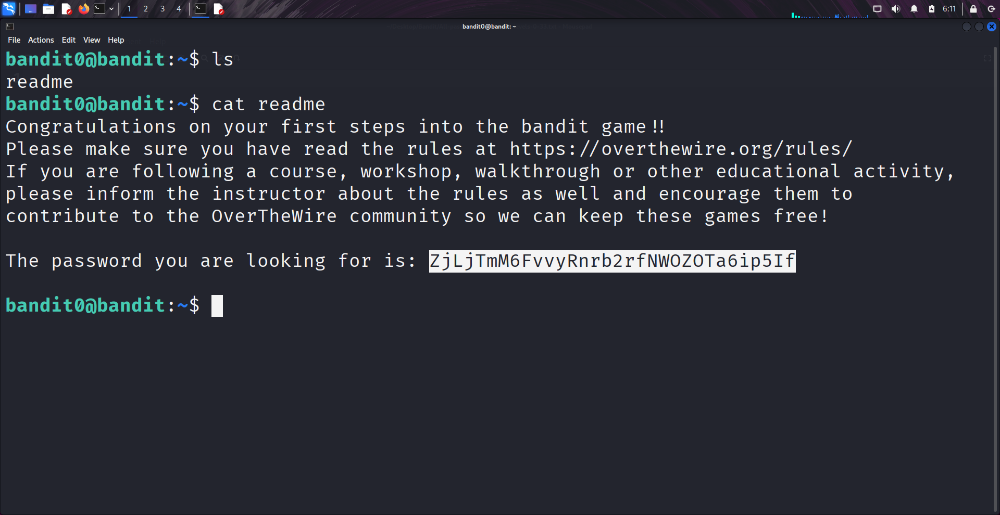

````markdown
# Written by: VINOD .N. RATHOD  

# Bandit Walkthrough — Level 0 → Level 1  

# Date: 19-08-2025  

## Objective  
Find the password for the next user (**bandit1**) by locating and reading a file named `readme`.  
````
## **Steps to Solve**  
1. After logging in as **bandit0**, list the files in the current directory:  
```bash
   ls -la
```

2. You will see a file named `readme`.  
3. Display the contents of the file to reveal the password:  
```bash
   cat readme
```   
  

4. Use the retrieved password to log in as **bandit1**:  
```bash
   ssh bandit1@localhost -p 2220
```  

5. Enter the password obtained from the `readme` file when prompted.  

## **Outcome**  
* Successfully retrieved the password for **bandit1**.  
* Logged into the next level using **SSH**.  
---
# THANK YOU!
#  ~ **V1NNN22** ~
