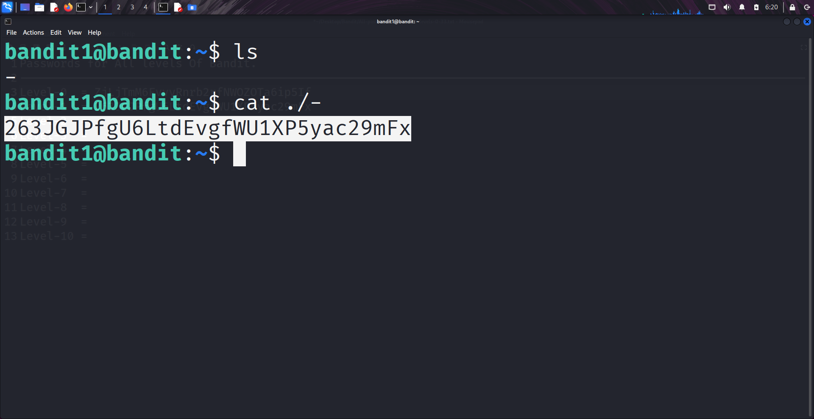

````markdown
# Written by: VINOD .N. RATHOD 

# Bandit Walkthrough — Level 1 → Level 2

# Date: 19-08-2025

## Objective
Retrieve the password for bandit2, which is stored in a file named `-` (a hyphen).
````

## **Steps to Solve**
1. After logging in as bandit1, list the files in the current directory:
```bash
   ls
````

2. You will notice a file named `-`.
3. Normally, using `cat -` won’t work because the hyphen is interpreted as stdin/stdout by the shell.
4. To correctly read the file, prefix it with `./` to specify the current directory:

```bash
   cat ./-
```



   
5. Use the retrieved password to log in as bandit2:

```bash
   ssh bandit2@localhost -p 2220
```
6. Enter the password when prompted.

## **Outcome**

* Successfully retrieved the password stored in the `-` file.
* Logged into the server as **bandit2**.
---
# THANK YOU!
#  ~ **V1NNN22** ~
