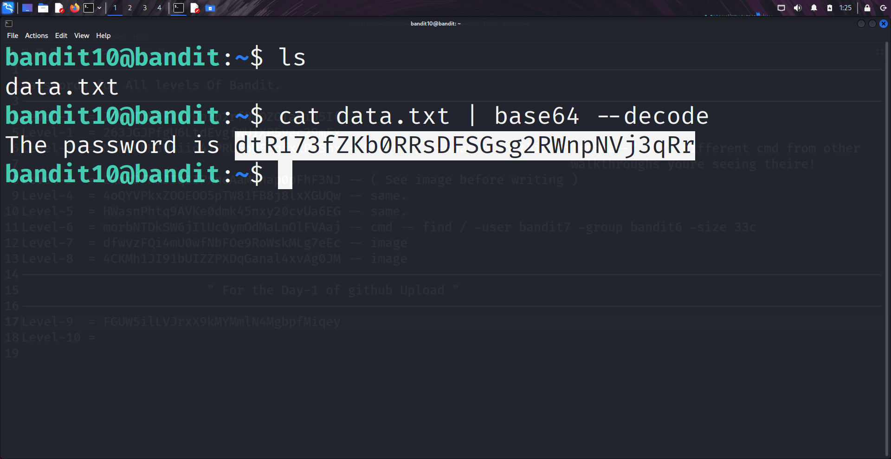

```markdown
# Written by: VINOD .N. RATHOD  

# Bandit Walkthrough — Level 10 → Level 11  

# Date: 21-08-2025  

## Objective  
Retrieve the password for bandit11, which is stored in the file `data.txt`. The hint specifies that the file’s contents are encoded in ""Base64".  
```

## **Steps to Solve**

1. After logging in as **bandit10**, list the files in the current directory:

```bash
   ls
```

You will see a file named `data.txt`.

2. The file contains data encoded in Base64. If viewed directly with `cat`, it shows encoded text.
3. Use the following command to read and decode the text at the same time:

```bash
   cat data.txt | base64 --decode
```

* `cat data.txt` → Reads the file.
* `|` (pipe) → Sends output to the next command.
* `base64 --decode` → Decodes Base64 into plain text.

4. The output will display the password for **bandit11**.



5. Use the retrieved password to log in as **bandit11**:

```bash
   ssh bandit11@localhost -p 2220
```


## **Outcome**

* Successfully decoded Base64-encoded text from `data.txt`.
* Retrieved the password for **bandit11**.
* Logged into the server as **bandit11**.

---

# THANK YOU!

# \~ **V1NNN22** \~

