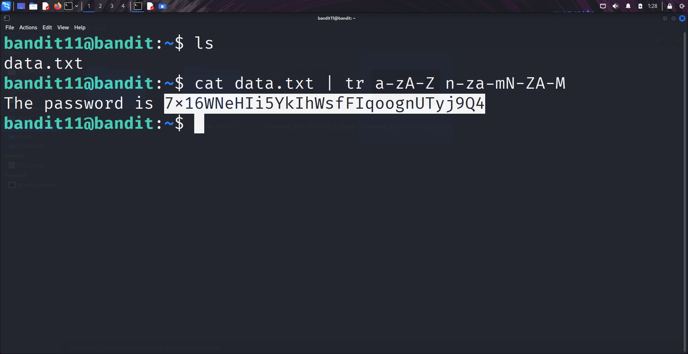

```markdown
# Written by: VINOD .N. RATHOD  

# Bandit Walkthrough — Level 11 → Level 12  

# Date: 21-08-2025  

## Objective  
Retrieve the password for bandit12, which is stored in the file `data.txt`. The hint specifies that the text is encoded using "ROT13", where each letter is shifted by 13 positions in the alphabet.  
```

## **Steps to Solve**

1. After logging in as **bandit11**, list the files in the current directory:

```bash
   ls
```

You will see a file named `data.txt`.

2. The contents of this file are encoded in ROT13.
   To decode it, use the `tr` (translate) command:

```bash
   cat data.txt | tr a-zA-Z n-za-mN-ZA-M
```

* `cat data.txt` → Reads the file.
* `|` (pipe) → Sends the output to the next command.
* `tr a-zA-Z n-za-mN-ZA-M` → Translates each letter by shifting it 13 positions (**ROT13**).

3. The output will display the decoded password for **bandit12**.



4. Use the retrieved password to log in as **bandit12**:

```bash
   ssh bandit12@localhost -p 2220
```


## **Outcome**

* Successfully decoded ROT13 text from `data.txt`.
* Retrieved the password for **bandit12**.
* Logged into the server as **bandit12**.

---

# THANK YOU!

# \~ **V1NNN22** \~


