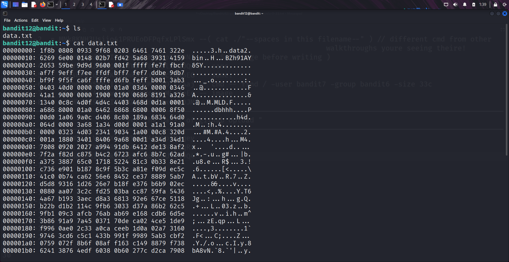
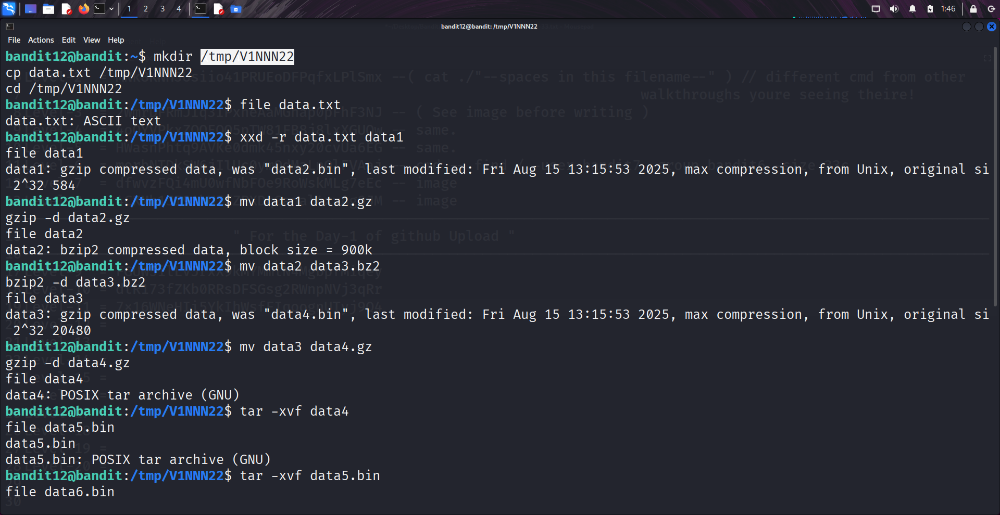
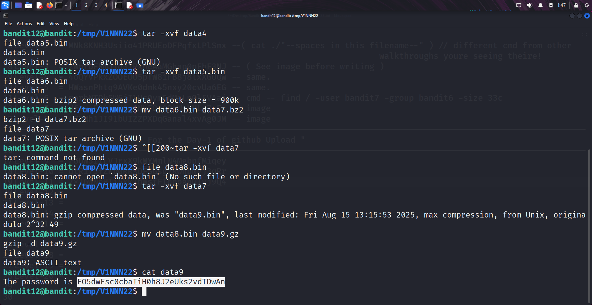

```markdown
# Written by: VINOD .N. RATHOD  

# Bandit Walkthrough — Level 12 → Level 13  

# Date: 21-08-2025  

## Objective  
Retrieve the password for bandit13, which is stored in `data.txt`. The hint specifies that the file is a hex dump that has been repeatedly compressed in different formats.  
```

## **Steps to Solve**

1. After logging in as **bandit12**, list the files in the current directory:

```bash
   ls
```

You will see `data.txt`.




2. Viewing the file with `cat` shows a hex dump (not readable).
   To properly process it, first create a working directory inside `/tmp` with write permissions:

```bash
   mkdir /tmp/V1NNN22
   cp data.txt /tmp/V1NNN22
   cd /tmp/V1NNN22
```

3. Verify file type:

```bash
   file data.txt
```

Output: **ASCII text** (but actually a hex dump).

4. Convert the hex dump back to its original binary form using `xxd`:

```bash
   xxd -r data.txt data1
   file data1
```

Result: **gzip compressed file**.

### 1. First Decompression (gzip)

```bash
   mv data1 data2.gz
   gzip -d data2.gz
   file data2
```

Result: **bzip2 compressed file**.

### 2. Second Decompression (bzip2)

```bash
   mv data2 data3.bz2
   bzip2 -d data3.bz2
   file data3
```

Result: **gzip compressed file**.

### 3. Third Decompression (gzip)

```bash
   mv data3 data4.gz
   gzip -d data4.gz
   file data4
```

Result: **tar archive**.

### 4. Fourth Extraction (tar)

```bash
   tar -xvf data4
   file data5.bin
```

Result: **another tar archive**.

### 5. Fifth Extraction (tar)

```bash
   tar -xvf data5.bin
   file data6.bin
```




Result: **bzip2 compressed file**.

### 6. Sixth Decompression (bzip2)

```bash
   mv data6.bin data7.bz2
   bzip2 -d data7.bz2
   file data7
```

Result: **tar archive**.

### 7. Seventh Extraction (tar)

```bash
   tar -xvf data7
   file data8.bin
```

Result: **gzip compressed file**.

### 8. Eighth Decompression (gzip)

```bash
   mv data8.bin data9.gz
   gzip -d data9.gz
   file data9
```

Result: **ASCII text file**.

### 9. Final Step — Read Password

```bash
   cat data9
```

This displays the password for **bandit13**.




5. Use the password to log in as **bandit13**:

```bash
   ssh bandit13@localhost -p 2220
```


## **Outcome**

* Successfully reverted the hex dump.
* Repeatedly decompressed/extracted files until reaching plain text.
* Retrieved the password for **bandit13**.
* Logged into the server as **bandit13**.

---

# THANK YOU!

# \~ **V1NNN22** \~

