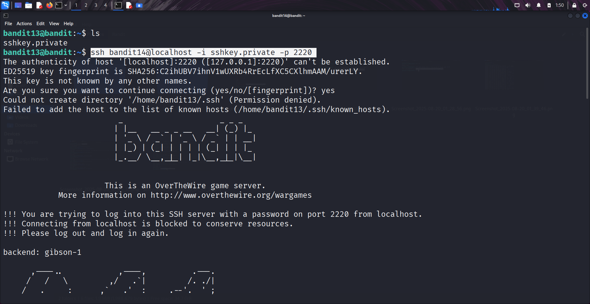

```markdown
# Written by: VINOD .N. RATHOD  

# Bandit Walkthrough — Level 13 → Level 14  

# Date: 22-08-2025  

## Objective  
Access the next level ("bandit14") using the provided "SSH private key" instead of a password.  
```

## **Steps to Solve**

1. After logging in as **bandit13**, list the files in the current directory:

```bash
   ls
```

You will see a file named `sshkey.private`.

2. Use the private key with the `ssh` command to log in as **bandit14**:

```bash
   ssh bandit14@localhost -i sshkey.private -p 2220
```

* `-i sshkey.private` → Specifies the private key file for authentication.
* `-p 2220` → Ensures connection is made on the correct port.

3. You should now be logged in as **bandit14** without being asked for a password.



## **Outcome**

* Successfully used the provided **SSH private key**.
* Logged into the server as **bandit14**.

---

# THANK YOU!

# \~ **V1NNN22** \~

