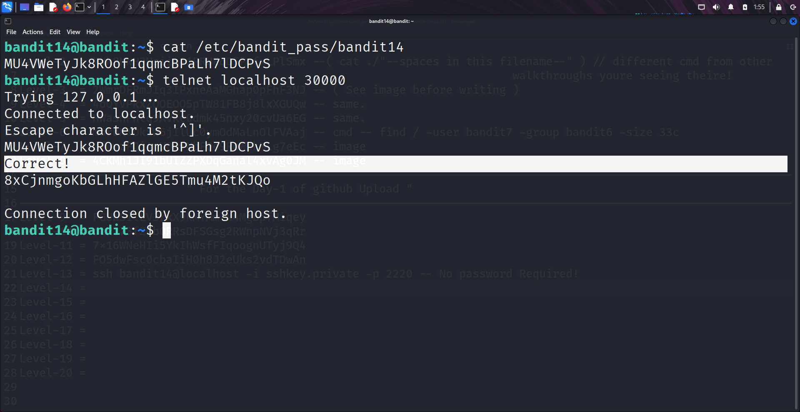

```markdown
# Written by: VINOD .N. RATHOD  

# Bandit Walkthrough — Level 14 → Level 15  

# Date: 22-08-2025  

## Objective  
Retrieve the password for bandit15 by submitting the current level’s password ("bandit14") to port "30000" on `localhost`.  
```

## **Steps to Solve**

1. After logging in as **bandit14**, retrieve the password for the current level from the `/etc/bandit_pass/` directory:

```bash
   cat /etc/bandit_pass/bandit14
```

Copy this password.

2. Connect to port **30000** on `localhost` using `telnet`:

```bash
   telnet localhost 30000
```

3. Once connected, enter the **bandit14** password.

* If the password is correct, the server will return the password for **bandit15**.



4. Use the retrieved password to log in as **bandit15**:

```bash
   ssh bandit15@localhost -p 2220
```


## **Outcome**

* Successfully connected to port **30000** with `telnet`.
* Retrieved the password for **bandit15**.
* Logged into the server as **bandit15**.

---

# THANK YOU!

# \~ **V1NNN22** \~


