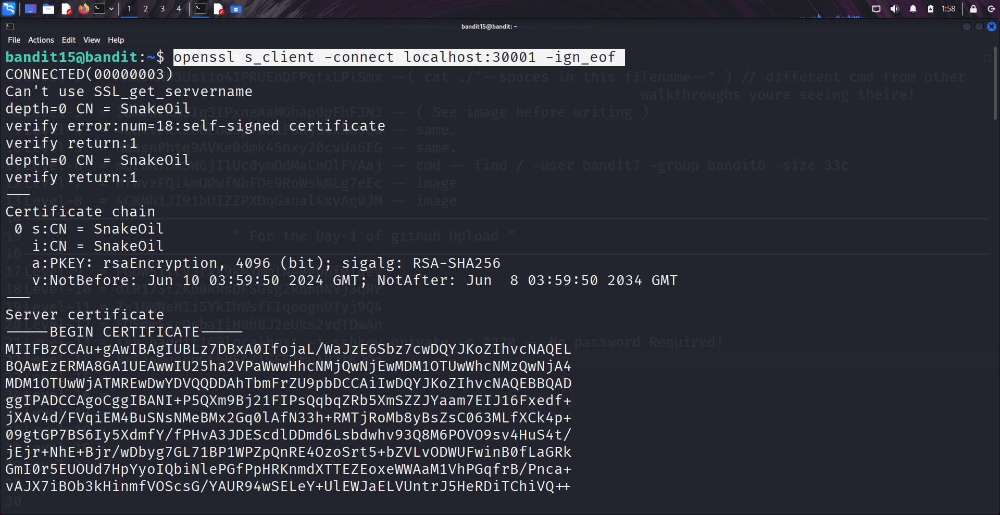
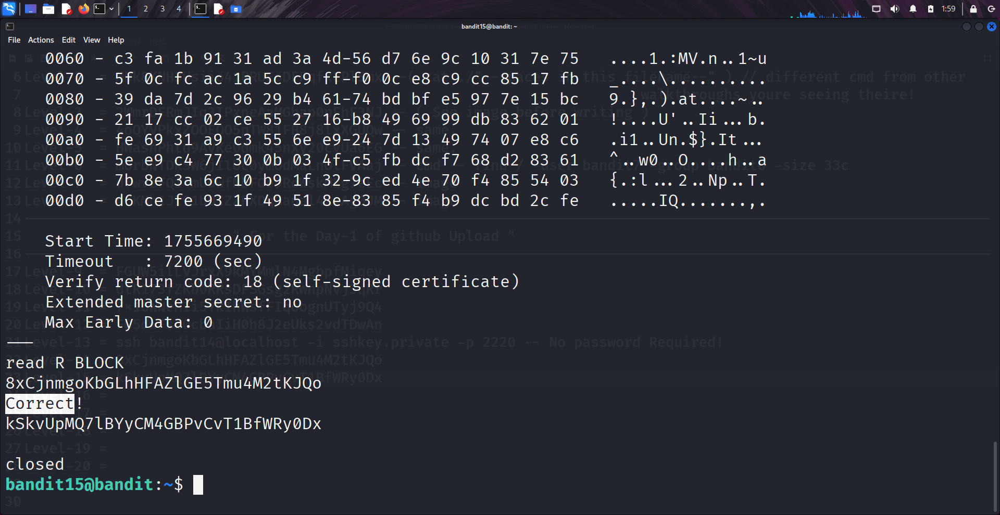

```markdown
# Written by: VINOD .N. RATHOD  

# Bandit Walkthrough — Level 15 → Level 16  

# Date: 22-08-2025  

## Objective  
Retrieve the password for bandit16 by submitting the current level’s password ("bandit15") to port "30001" on `localhost` using "SSL encryption".  
```

## **Steps to Solve**

1. After logging in as **bandit15**, establish an SSL connection to port **30001** using the `openssl` command:

```bash
   openssl s_client -connect localhost:30001 -ign_eof
```

* `s_client` → Connects as an SSL/TLS client.
* `-connect localhost:30001` → Specifies the target host and port.
* `-ign_eof` → Prevents the connection from closing immediately when input ends.



2. Once connected, enter the **bandit15** password.
3. If the password is correct, the server will return the password for **bandit16**.



4. Use the retrieved password to log in as **bandit16**:

```bash
   ssh bandit16@localhost -p 2220
```


## **Outcome**

* Successfully established an **SSL connection** to port **30001**.
* Verified the current password and received the password for **bandit16**.
* Logged into the server as **bandit16**.

---

# THANK YOU!

# \~ **V1NNN22** \~


