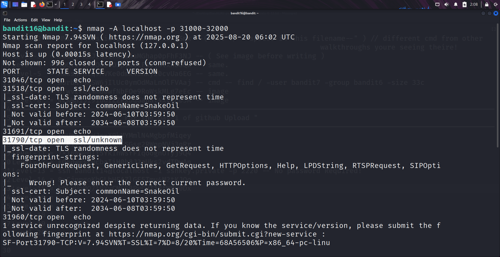
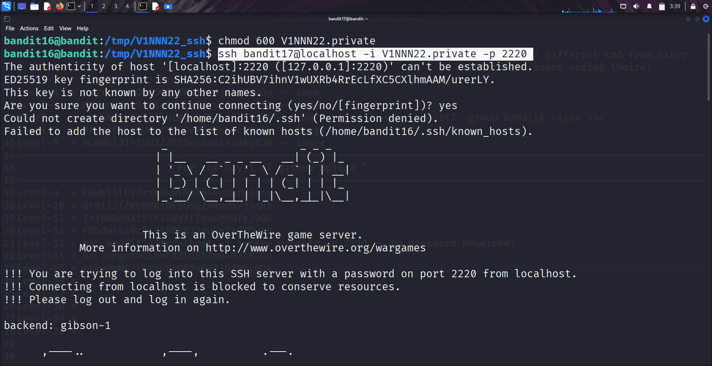
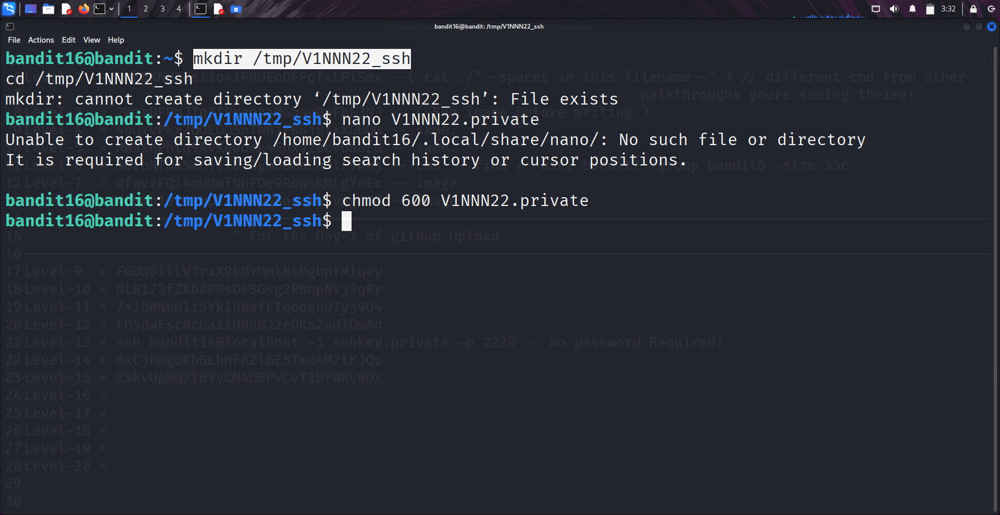

```markdown
# Written by: VINOD .N. RATHOD  

# Bandit Walkthrough — Level 16 → Level 17  

# Date: 22-08-2025  

## Objective  
Retrieve the credentials for bandit17 by scanning a port range, finding the correct port, and using the password of "bandit16". The connection reveals an "RSA private key", which must be saved and used for SSH login.  
```

## **Steps to Solve**

### 1. Scan the Port Range

The password for **bandit17** is hidden on a port between **31000–32000**. Use `nmap` to identify the open service:

```bash
   nmap -A localhost -p 31000-32000
```

* From the scan results, **port 31790** is identified as requiring the **bandit16** password.



### 2. Connect to the Correct Port

Use `openssl` to connect to the discovered port:

```bash
   openssl s_client -connect localhost:31790
```
* Enter the **bandit16** password when prompted.
* Upon successful verification, the server provides an **RSA private key**.



### 3. Save the RSA Key as a File

1. Create a temporary working directory:

```bash
   mkdir /tmp/V1NNN22_ssh
   cd /tmp/V1NNN22_ssh
```




2. Create a file for the private key (example using `nano`):

```bash
   nano V1NNN22.private
```

3. Paste the RSA private key into the file.
4. Save and exit (`Ctrl+X`, then `y`, then `Enter`).

### 4. Fix File Permissions

SSH requires private keys to have restricted permissions. Set them using `chmod`:

```bash
   chmod 600 V1NNN22.private
```

### 5. Use the Private Key for SSH Login

Log in as **bandit17** with the private key:

```bash
   ssh bandit17@localhost -i V1NNN22.private -p 2220
```


## **Outcome**

* Successfully scanned ports and identified the correct one (**31790**).
* Retrieved an **RSA private key** from the server.
* Saved the key securely and adjusted file permissions.
* Logged into the server as **bandit17**.

---

# THANK YOU!

# \~ **V1NNN22** \~


