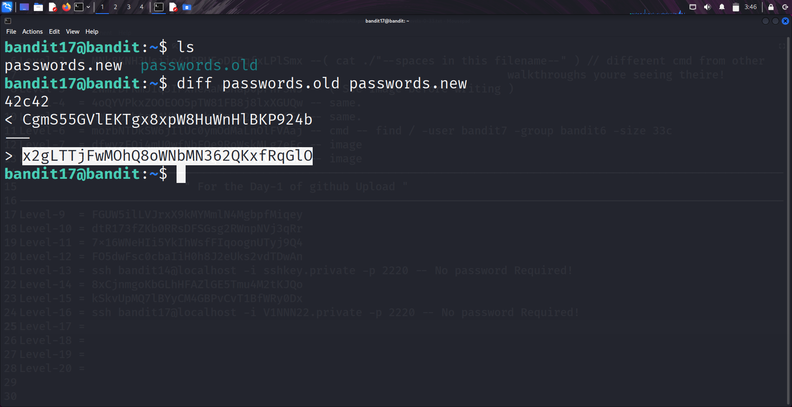

```markdown
# Written by: VINOD .N. RATHOD  

# Bandit Walkthrough — Level 17 → Level 18 (both 17 & 18 solved here)  

# Date: 22-08-2025  

## Objective  
Retrieve the password for "bandit19". The password for "bandit18" is stored in the only line that differs between `passwords.old` and `passwords.new`. However, direct SSH from localhost is blocked, so the solution requires a different approach.  
```

## **Steps to Solve**

1. After logging in as **bandit17**, list the files:

```bash
   ls
```

You will see two files: `passwords.old` and `passwords.new`.

2. Compare both files to identify the changed line:

```bash
   diff passwords.old passwords.new
```

The differing line is the password for **bandit18**.
*(Save this password — you’ll need it to connect from your local machine.)*




!! **Important Note** !!
Normally, you would log into bandit18 with:

```bash
   ssh bandit18@localhost -p 2220
```

However, OverTheWire blocks SSH connections to localhost from inside the game.
So instead, you must reconnect from your **local machine** using the password you just obtained.

### New Working Method

3. To verify files in bandit18’s home directory remotely (without logging in interactively), run:

```bash
   ssh bandit18@bandit.labs.overthewire.org -p 2220 ls
```

Output shows a file named `readme`.

4. Read the contents of `readme` directly:

```bash
   ssh bandit18@bandit.labs.overthewire.org -p 2220 cat readme
```

This displays the password for **bandit19**.


5. Use the retrieved password to log in as **bandit19**:

```bash
   ssh bandit19@bandit.labs.overthewire.org -p 2220
```

## **Outcome**

* Successfully identified the changed line between `passwords.old` and `passwords.new` → password for **bandit18**.
* Used remote SSH one-liners to bypass localhost restrictions.
* Retrieved the password for **bandit19** from `readme`.
* Logged into the server as **bandit19**.

---

# THANK YOU!

# \~ **V1NNN22** \~


