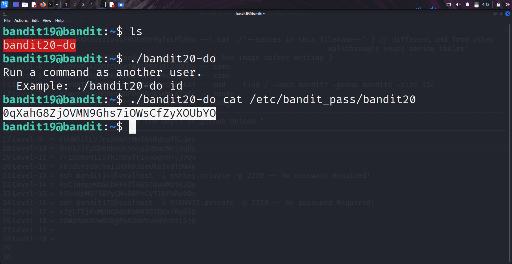

```markdown
# Written by: VINOD .N. RATHOD  

# Bandit Walkthrough — Level 19 → Level 20  

# Date: 23-08-2025  

## Objective  
Retrieve the password for bandit20 by using a special script ("bandit20-do") that allows execution of commands as another user.  
```

## **Steps to Solve**

1. After logging in as **bandit19**, list the files in the directory:

```bash
   ls
```

You will see a file named `bandit20-do`.

2. Check how the script works by running it without arguments:

```bash
   ./bandit20-do
```

The output shows that it allows you to run commands as the **bandit20** user.

3. Since all passwords are stored in `/etc/bandit_pass/`, run the script with `cat` to read the password for **bandit20**:

```bash
   ./bandit20-do cat /etc/bandit_pass/bandit20
```

This displays the password for **bandit20**.




4. Use the retrieved password to log in as **bandit20**:

```bash
   ssh bandit20@bandit.labs.overthewire.org -p 2220
```

## **Outcome**

* Discovered the helper script `bandit20-do`.
* Used it to execute `cat` as **bandit20**.
* Retrieved the password for **bandit20**.
* Logged into the server as **bandit20**.

---

# THANK YOU!

# \~ **V1NNN22** \~

