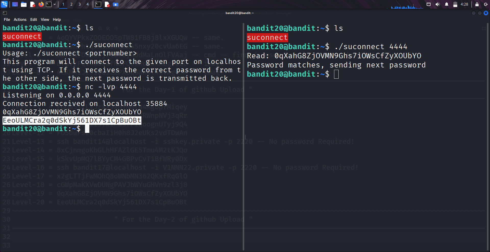

```markdown
# Written by: VINOD .N. RATHOD  

# Bandit Walkthrough — Level 20 → Level 21  

# Date: 23-08-2025  

## Objective  
Retrieve the password for bandit21 by exploiting a "setuid binary" (`suconnect`) that connects to a local port and verifies the current level’s password.  
```

## **Steps to Solve**

### Step 1 — Explore the Directory

1. After logging in as **bandit20**, list the available files:

```bash
   ls
```

You will find a binary named:

```
suconnect
```

2. Run it without parameters to see usage:

```bash
   ./suconnect
```

Output:

```
Usage: ./suconnect <port>
```

→ It expects a port number to connect to.

---

### Step 2 — Prepare Two Sessions

Because `suconnect` connects to a local port, we need **two terminal sessions**:

* **Session 1**: Run `suconnect`.
* **Session 2**: Run a `netcat` listener on the same port.

---

### Step 3 — Start the Netcat Listener

3. In **Session 2**, start a netcat listener on port **4444**:

```bash
   nc -lvp 4444
```

→ This waits for incoming connections.

---

### Step 4 — Run suconnect

4. In **Session 1**, run `suconnect` with the same port:

```bash
   ./suconnect 4444
```

→ This connects to the listener created in Session 2.

---

### Step 5 — Provide the Current Password

5. In **Session 2** (netcat window), enter the password of **bandit20**.

* `suconnect` verifies it.
* If correct, it responds with the password for **bandit21**.

---




### Final Step — Connect as bandit21

6. With the new password, log in as **bandit21**:

```bash
   ssh bandit21@bandit.labs.overthewire.org -p 2220
```


## **Outcome**

* Learned how to work with a **setuid binary** that connects over TCP.
* Understood how to coordinate **two sessions** (`netcat` listener + `suconnect`).
* Successfully retrieved the password for **bandit21**.

---

# THANK YOU!

# \~ **V1NNN22** \~


