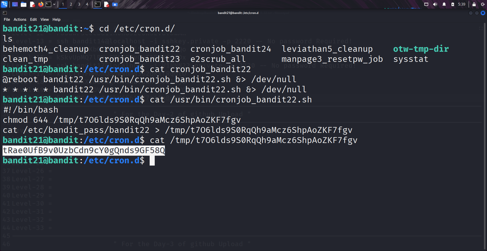

```markdown
# Written by: VINOD .N. RATHOD  

# Bandit Walkthrough — Level 21 → Level 22  

# Date: 23-08-2025  

## Objective  
Retrieve the password for bandit22 by examining scheduled "cron jobs" that run under the "bandit22" user.  
```

## **Steps to Solve**

1. After logging in as **bandit21**, navigate to the cron jobs directory:

```bash
   cd /etc/cron.d/
   ls
```

You will see a file named `cronjob_bandit22`.

2. View the contents of this cron job file:

```bash
   cat cronjob_bandit22
```

It shows that a script `/usr/bin/cronjob_bandit22.sh` is executed periodically.

3. Read the script to see what it does:

```bash
   cat /usr/bin/cronjob_bandit22.sh
```

The script writes the password for **bandit22** into a file inside `/tmp`.

4. Read the file created by the script:

```bash
   cat /tmp/t7O6lds9S0RqQh9aMcz6ShpAoZKF7fgv
```

This reveals the password for **bandit22**.




### Final Step — Connect as bandit22

5. Use the retrieved password to log in from your local machine:

```bash
   ssh bandit22@bandit.labs.overthewire.org -p 2220
```

## **Outcome**

* Enumerated cron jobs in `/etc/cron.d/`.
* Found the scheduled script for **bandit22**.
* Retrieved the password from the temporary file written by the cron job.
* Logged into the server as **bandit22**.

---

# THANK YOU!

# \~ **V1NNN22** \~


