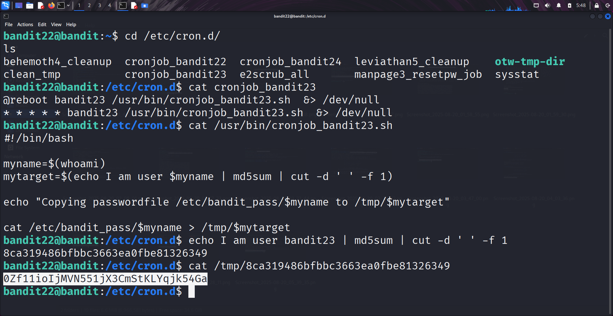

```markdown
# Written by: VINOD .N. RATHOD  

# Bandit Walkthrough — Level 22 → Level 23  

# Date: 23-08-2025  

## Objective  
Retrieve the password for bandit23 by analyzing the "cron job" running for this user. The cron script generates a file in `/tmp` whose name is derived from an "MD5 hash".  
```

## **Steps to Solve**

1. After logging in as **bandit22**, navigate to the cron jobs directory:

```bash
   cd /etc/cron.d/
   ls
```

You will see a file named `cronjob_bandit23`.

2. View the contents of the cron job:

```bash
   cat cronjob_bandit23
```

It executes `/usr/bin/cronjob_bandit23.sh`.

3. Read the script to understand what it does:

```bash
   cat /usr/bin/cronjob_bandit23.sh
```

* The script sets a variable `myname=$(whoami)`.
* For **bandit22**, this means `myname=bandit22`.
* It then prints `I am user bandit22`, calculates the **MD5 hash** of this string, and uses that hash as a filename in `/tmp`.
* That file contains the password for the next level.

### Step 4 — Generate the Correct Hash for bandit23

4. Since we need the password for **bandit23**, we replace bandit22 with bandit23 in the string:

```bash
   echo I am user bandit23 | md5sum | cut -d ' ' -f 1
```

This produces the hash:

```
8ca319486bfbbc3663ea0fbe81326349
```

### Step 5 — Read the Password File

5. Using the generated hash as the filename, read the file in `/tmp`:

```bash
   cat /tmp/8ca319486bfbbc3663ea0fbe81326349
```

This reveals the password for **bandit23**.



### Final Step — Connect as bandit23

6. Use the retrieved password to log in from your local machine:

```bash
   ssh bandit23@bandit.labs.overthewire.org -p 2220
```

## **Outcome**

* Discovered and analyzed the cron job for **bandit23**.
* Understood that the filename is derived from an MD5 hash of the string `I am user bandit23`.
* Generated the hash and used it to locate the password file in `/tmp`.
* Retrieved the password for **bandit23** and logged into the server.

---

# THANK YOU!

# \~ **V1NNN22** \~


