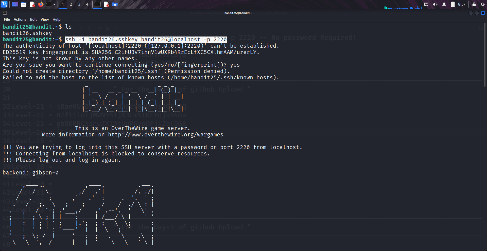
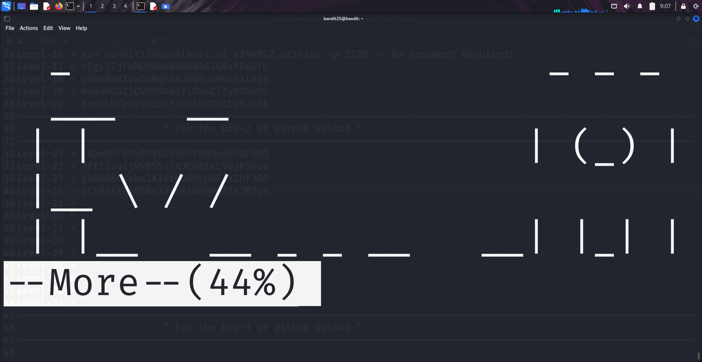
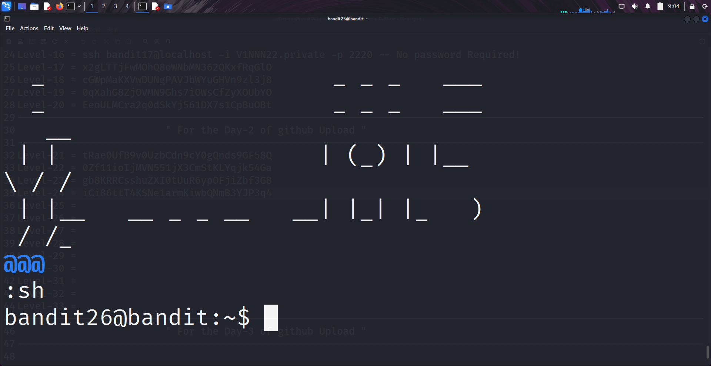
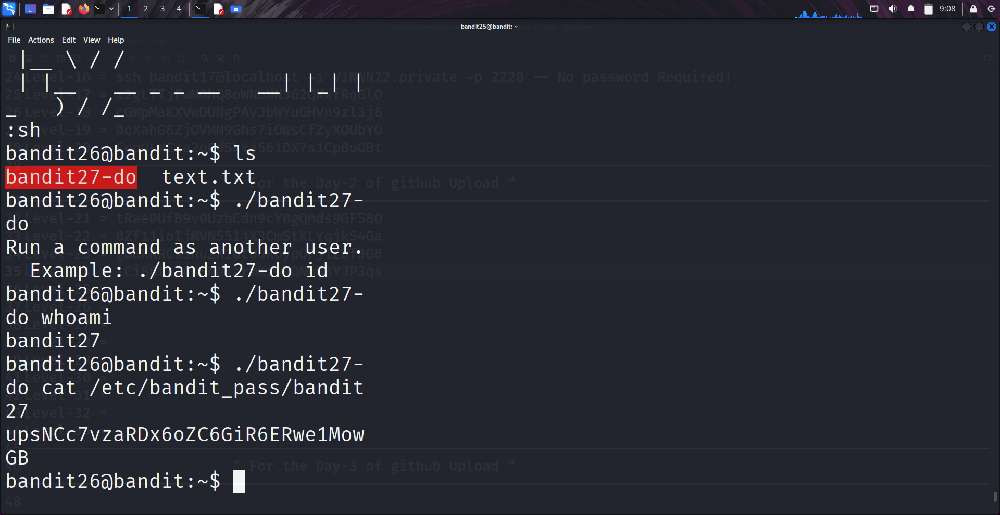

```markdown
# Written by: VINOD .N. RATHOD  

# Bandit Walkthrough — Level 25 → Level 26  

# Date: 24-08-2025  

## Objective  
Retrieve the shell access for user "bandit26". Unlike previous levels, bandit26 does not use `/bin/bash` as its login shell. Instead, the login process executes a custom program called "showtext", which exits after displaying text. The challenge is to bypass this restriction and obtain a working shell.  
```

## **Steps to Solve**

### Step 1 — Inspect Available Files

1. After logging in as **bandit25**, list the files:

```bash
   ls
```

Output shows:

```
bandit26.sshkey
```

→ This is the SSH private key for **bandit26**.

2. Attempt to connect using the key:

```bash
   ssh -i bandit26.sshkey bandit26@localhost -p 2220
```

Result: The connection opens briefly, displays an ASCII banner, then closes.

---




### Step 2 — Investigate the Issue

3. Check the login shell of **bandit26**:

```bash
   cat /etc/passwd | grep bandit26
```

You will see that the shell is set to `/usr/bin/showtext`.

4. Inspect this program:

```bash
   cat /usr/bin/showtext
```

It reveals that it uses the **more** pager to display the banner text.

**Observation:**

* If the terminal is large enough to display everything at once, `more` exits immediately → connection closes.
* If the terminal is too small, `more` will pause and wait for user input.

---

### Step 3 — Force *more* to Pause

5. Resize your terminal window to just a few rows (e.g., 5–6 lines tall).
   → This ensures `more` cannot display the entire banner at once.

6. Reconnect:

```bash
   ssh -i bandit26.sshkey bandit26@localhost -p 2220
```

7. This time, `more` pauses with a `:` prompt at the bottom.

---

### Step 4 — Escape to a Shell

8. At the `more` prompt, press:

```
v
```

→ This launches **vi** (text editor) inside the session.




9. In vi, set the shell to `/bin/bash`:

```
:set shell=/bin/bash
```

10. Spawn a shell:

```
:sh
```


11. You now have a working shell as **bandit26**.

---

### Final Step — Continue to Next Level

With the interactive shell open as **bandit26**, proceed to solve **Level 26 → 27**.




## **Outcome**

* Learned that **bandit26** does not use `/bin/bash` as login shell.
* Discovered the **showtext** wrapper forces `more`.
* Bypassed the restriction by resizing the terminal, forcing `more` to pause, and escaping into **vi**.
* Successfully obtained an interactive shell as **bandit26**.

---

# THANK YOU!

# \~ **V1NNN22** \~


