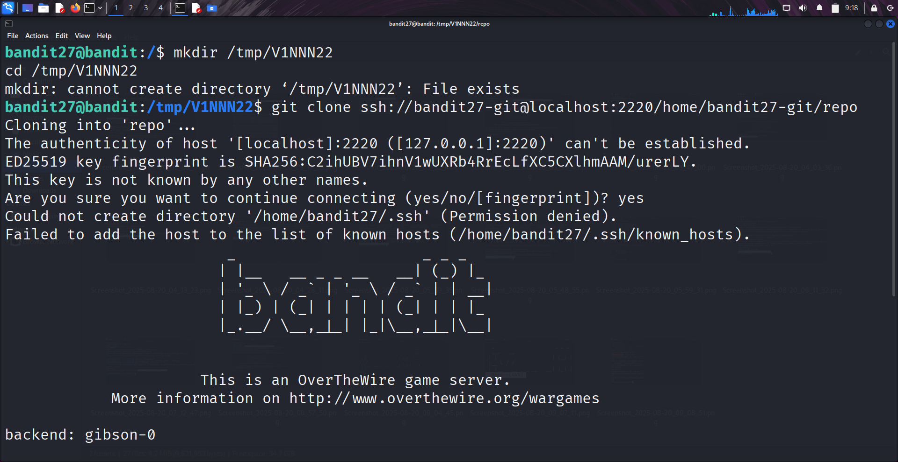
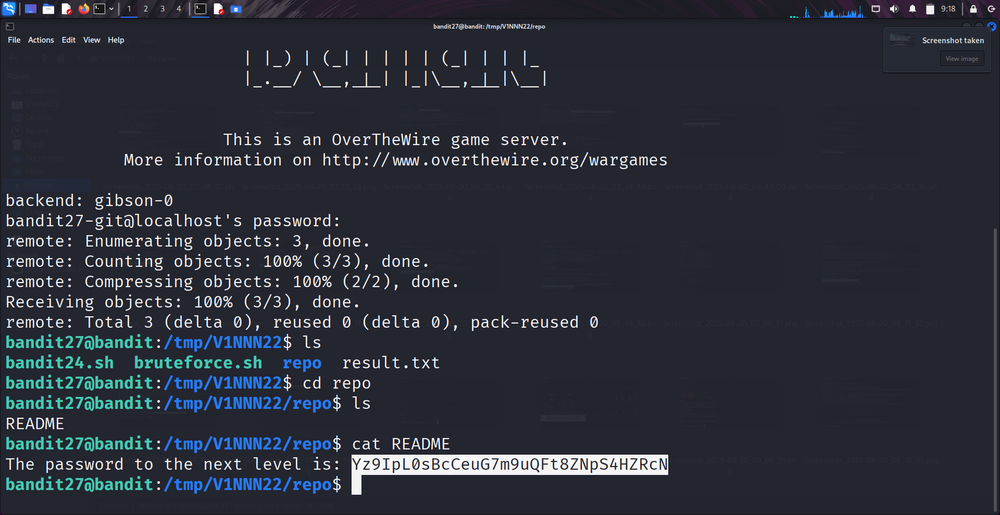

```markdown
# Written by: VINOD .N. RATHOD  

# Bandit Walkthrough — Level 27 → Level 28  

# Date: 24-08-2025  

## Objective  
Retrieve the password for "bandit28" by cloning and inspecting the provided "Git repository".  
```

## **Steps to Solve**

### Step 1 — Prepare a Working Directory

1. After logging in as **bandit27**, create a temporary directory to store the cloned repository:

```bash
   mkdir /tmp/V1NNN22
   cd /tmp/V1NNN22
```

---

### Step 2 — Clone the Repository

2. Clone the Git repository using the correct port (**2220**):

```bash
   git clone ssh://bandit27-git@localhost:2220/home/bandit27-git/repo
```

* Without specifying `:2220`, Git defaults to port **22**, which is blocked.
* Using `:2220` ensures it connects properly.

---



### Step 3 — Explore the Repository

3. Move into the cloned repository and list its contents:

```bash
   cd repo
   ls
```

You will see a file named `README`.

---

### Step 4 — Retrieve the Password

4. Read the `README` file:

```bash
   cat README
```

This file contains the password for **bandit28**.

---



### Final Step — Connect as bandit28

5. Use the retrieved password to log in as **bandit28**:

```bash
   ssh bandit28@bandit.labs.overthewire.org -p 2220
```

## **Outcome**

* Understood how to work with **Git over SSH** on a non-standard port.
* Successfully retrieved the password for **bandit28**.

---

# THANK YOU!

# \~ **V1NNN22** \~


