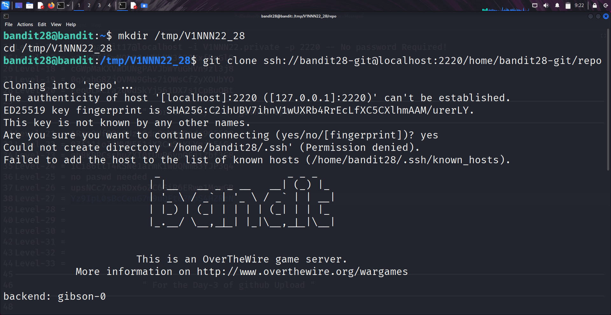
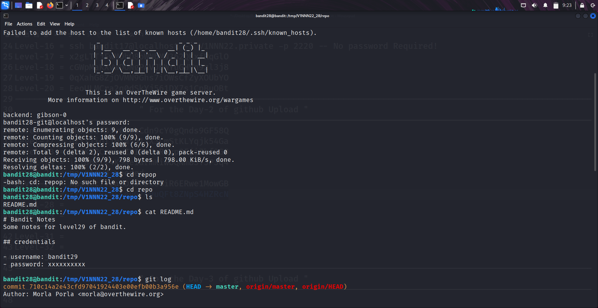
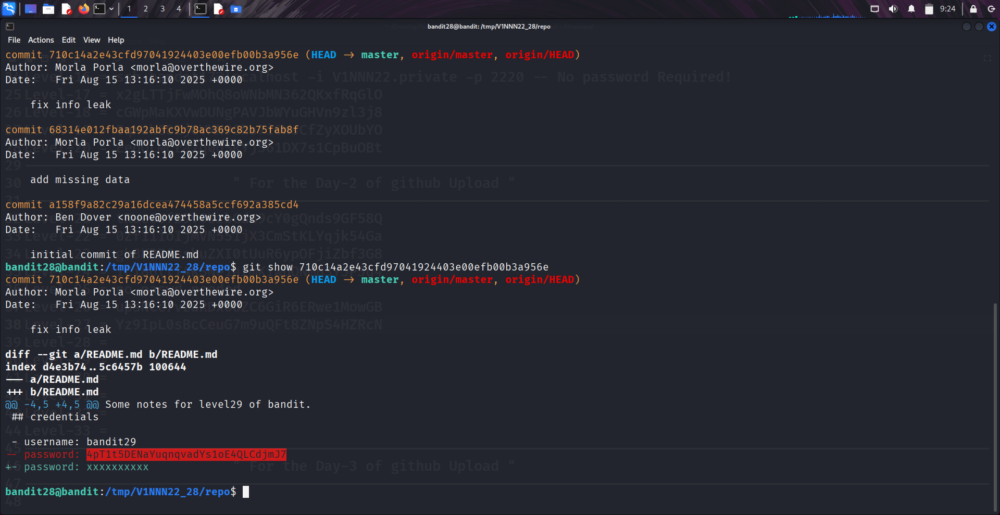

```markdown
# Written by: VINOD .N. RATHOD  

# Bandit Walkthrough — Level 28 → Level 29  

# Date: 25-08-2025  

## Objective  
Retrieve the password for "bandit29" by analyzing the "Git commit history" of the provided repository.  
```

## **Steps to Solve**

### Step 1 — Prepare a Working Directory

1. After logging in as **bandit28**, create a temporary directory to store the cloned repository:

```bash
   mkdir /tmp/V1NNN22_28
   cd /tmp/V1NNN22_28
```

---

### Step 2 — Clone the Repository

2. Clone the Git repository using the correct port (**2220**):

```bash
   git clone ssh://bandit28-git@localhost:2220/home/bandit28-git/repo
```


* Move into the cloned repository:

```bash
   cd repo
   ls
```

---

### Step 3 — Inspect Repository Files

3. Read the contents of the `README.md` file:

```bash
   cat README.md
```

The file does **not** reveal the password directly.

---

### Step 4 — Investigate Git History

4. Check the commit history for past changes:

```bash
   git log
```

* You will see a commit message like **"fix info leak"**, which indicates sensitive data may have been removed.



---

### Step 5 — View the Commit Changes

5. Use the `git show` command to inspect that commit:

```bash
   git show <commit-hash>
```

Example:

```bash
   git show 073c27c130e6ee407e12faad1dd3848a110c4f95
```

* Inside the commit diff, you will find the password for **bandit29**.

---


### Final Step — Connect as bandit29

6. With the retrieved password, log in as **bandit29**:

```bash
   ssh bandit29@bandit.labs.overthewire.org -p 2220
```


## **Outcome**

* Learned how to inspect **Git commit history** for removed or modified data.
* Successfully retrieved the password for **bandit29**.

---

# THANK YOU!

# \~ **V1NNN22** \~

