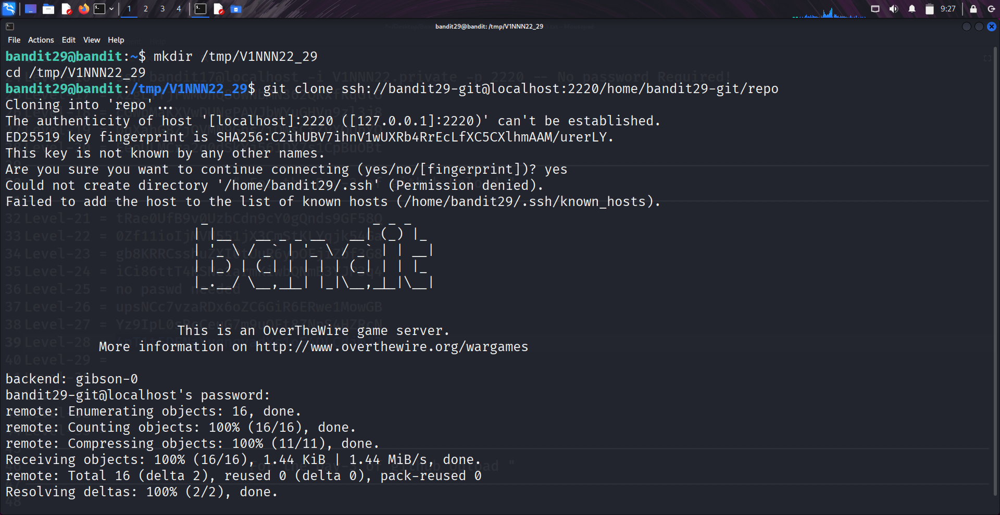
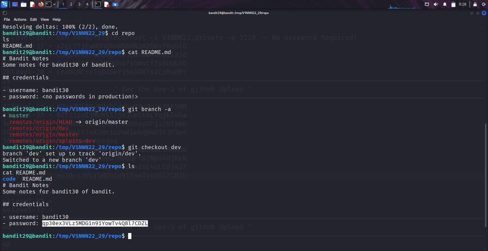

```markdown
# Written by: VINOD .N. RATHOD  

# Bandit Walkthrough — Level 29 → Level 30  

# Date: 25-08-2025  

## Objective  
Retrieve the password for "bandit30" by exploring "Git branches" in the provided repository.  
```

## **Steps to Solve**

### Step 1 — Prepare a Working Directory

1. After logging in as **bandit29**, create a temporary working directory:

```bash
   mkdir /tmp/V1NNN22_29
   cd /tmp/V1NNN22_29
```

---

### Step 2 — Clone the Repository

2. Clone the repository using the correct SSH port (**2220**):

```bash
   git clone ssh://bandit29-git@localhost:2220/home/bandit29-git/repo
```



3. Move into the cloned repository:

```bash
   cd repo
   ls
```

You will see a `README.md` file.

---

### Step 3 — Inspect the Default Branch

4. Read the `README.md`:

```bash
   cat README.md
```

It says that no password is stored in the **production branch**.

---

### Step 4 — Enumerate Git Branches

5. List all available branches:

```bash
   git branch -a
```

You will notice an additional branch named **dev**.

6. Switch to the **dev** branch:

```bash
   git checkout dev
```

---

### Step 5 — Retrieve the Password

7. Check the files inside this branch:

```bash
   ls
   cat README.md
```

This file contains the password for **bandit30**.

---



### Final Step — Connect as bandit30

8. Use the retrieved password to log in:

```bash
   ssh bandit30@bandit.labs.overthewire.org -p 2220
```

## **Outcome**

* Understood how **Git branches** can store alternate versions of files.
* Learned to enumerate and switch between branches to find hidden credentials.
* Successfully retrieved the password for **bandit30**.

---

# THANK YOU!

# \~ **V1NNN22** \~

