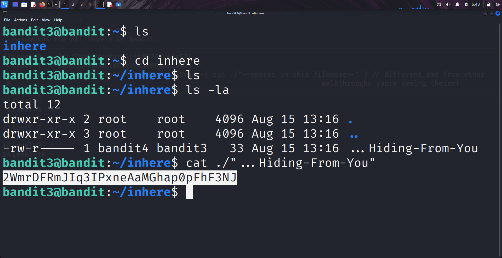

````markdown
# Written by: VINOD .N. RATHOD  

# Bandit Walkthrough — Level 3 → Level 4  

# Date: 19-08-2025  

## Objective  
Retrieve the password for bandit4, which is stored in a hidden file inside the `inhere` directory.  
````
## **Steps to Solve**  
1. After logging in as **bandit3**, list the files in the current directory:  
```bash
   ls
```  

2. You will see a directory named `inhere`. Navigate into it:  
```bash
   cd inhere/
```  

3. List the files inside:  
```bash
   ls
```  
At first glance, no file may appear.  

4. To reveal hidden files, use the `-al` flag with `ls`:  
```bash
   ls -al
```  

5. You will find a hidden file named `...Hiding-From-You`.  
6. Read the contents of this file using the following command:  
```bash
   cat "./...Hiding-From-You"
```  

7. This will display the password for **bandit4**.  

 

8. Use the retrieved password to log in as **bandit4**:  
```bash
   ssh bandit4@localhost -p 2220
```   

## **Outcome**  
* Successfully located the hidden file `...Hiding-From-You`.  
* Retrieved the password for **bandit4**.  
* Logged into the server as **bandit4**.  
---
# THANK YOU!
#  ~ **V1NNN22** ~
