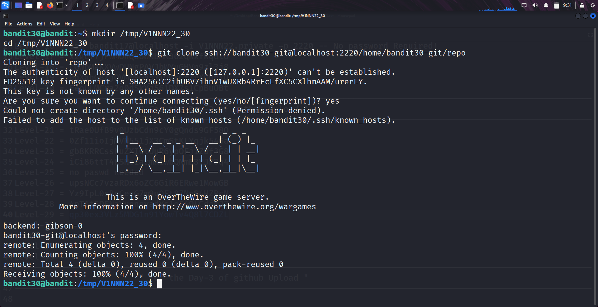
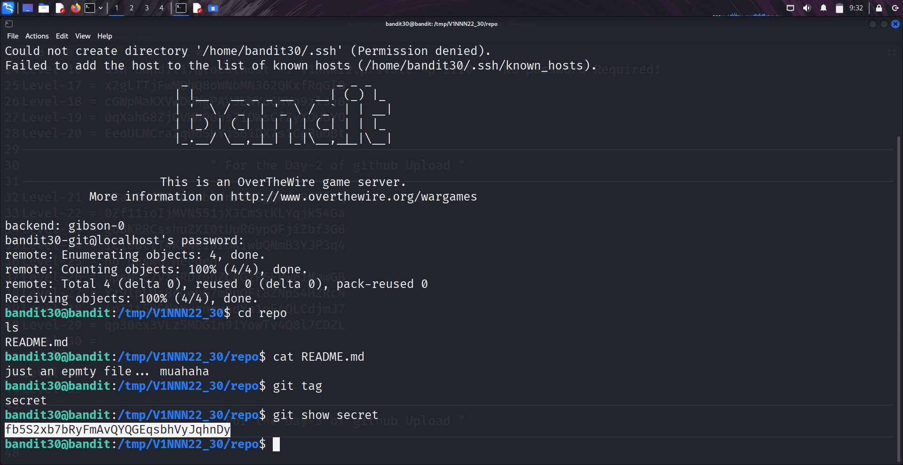

```markdown
# Written by: VINOD .N. RATHOD  

# Bandit Walkthrough — Level 30 → Level 31  

# Date: 25-08-2025  

## Objective  
Retrieve the password for "bandit31" by investigating "Git tags" in the repository.  
```

## **Steps to Solve**

### Step 1 — Prepare a Working Directory

1. After logging in as **bandit30**, create a temporary working directory:

```bash
   mkdir /tmp/V1NNN22_30
   cd /tmp/V1NNN22_30
```

---

### Step 2 — Clone the Repository

2. Clone the repository using the correct SSH port (**2220**):

```bash
   git clone ssh://bandit30-git@localhost:2220/home/bandit30-git/repo
```




3. Move into the cloned repository:

```bash
   cd repo
   ls
```

You will see a `README.md` file.

---

### Step 3 — Inspect the README File

4. Read the `README.md`:

```bash
   cat README.md
```

The file is **empty**. No password here.

---

### Step 4 — Enumerate Git Tags

5. Check if the repository contains any tags:

```bash
   git tag
```

You will find a tag named **secret**.

6. View the contents of the tag:

```bash
   git show secret
```

This reveals the password for **bandit31**.

---




### Final Step — Connect as bandit31

7. Use the retrieved password to log in:

```bash
   ssh bandit31@bandit.labs.overthewire.org -p 2220
```

## **Outcome**

* Learned how to enumerate **Git tags**.
* Understood that hidden credentials can be stored in Git metadata.
* Successfully retrieved the password for **bandit31**.

---

# THANK YOU!

# \~ **V1NNN22** \~


