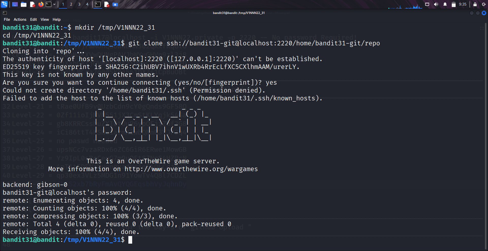
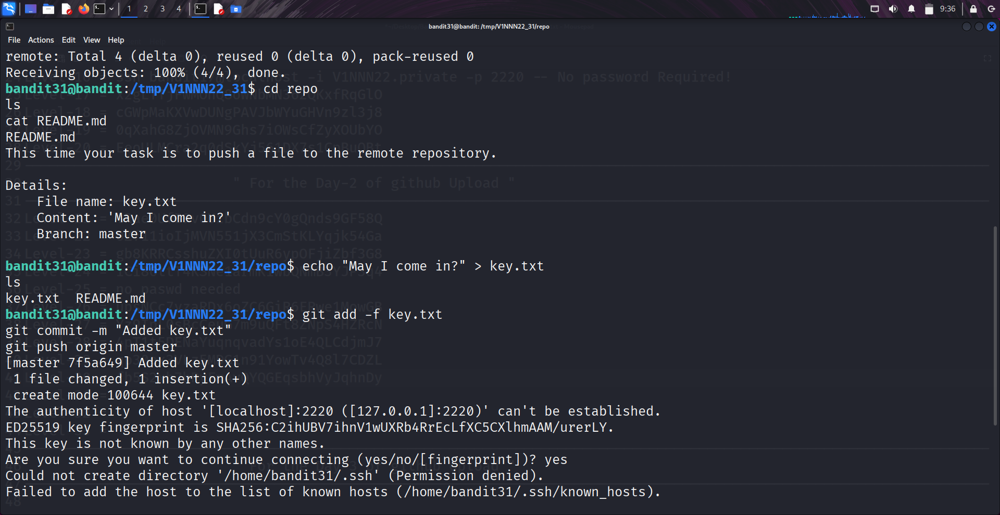
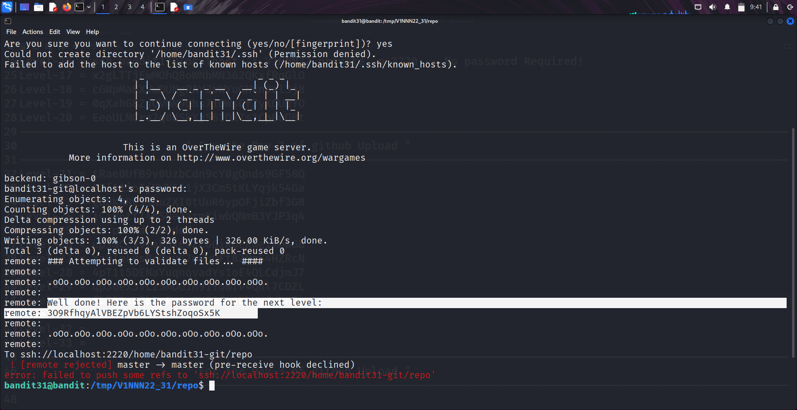

```markdown
# Written by: VINOD .N. RATHOD  

# Bandit Walkthrough — Level 31 → Level 32  

# Date: 25-08-2025  

## Objective  
Retrieve the password for "bandit32" by pushing a custom file (`key.txt`) with the phrase “May I come in?” into the Git repository.  
```

## **Steps to Solve**

### Step 1 — Prepare a Working Directory

1. After logging in as **bandit31**, create a temporary directory:

```bash
   mkdir /tmp/V1NNN22_31
   cd /tmp/V1NNN22_31
```

---

### Step 2 — Clone the Repository

2. Clone the Git repository using the SSH port (**2220**):

```bash
   git clone ssh://bandit31-git@localhost:2220/home/bandit31-git/repo
```



3. Enter the cloned repository:

```bash
   cd repo
   ls
```

---

### Step 3 — Read Instructions

4. Check the `README` file:

```bash
   cat README.md
```

* It instructs you to create a file named `key.txt` containing the text **“May I come in?”** and push it back to the repository.

---

### Step 4 — Create the Required File

5. Create the file:

```bash
   echo "May I come in?" > key.txt
   ls
```

---

### Step 5 — Commit and Push Changes

6. Stage and commit the new file:

```bash
   git add -f key.txt
   git commit -m "Added key.txt"
```

7. Push the change to the remote:

```bash
   git push origin master
```




* You’ll be prompted for the **bandit31 password**.
* After validation, the server responds with the password for **bandit32**:

```
Well done! Here is the password for the next level:
3O9RfhqyAlVBEZpVb6LYStshZoqoSx5K
```




!! **Note:** !! The push is rejected after validation (*pre-receive hook declined*). This is intentional — the validation happens before the push is blocked, so you still receive the password.

---

### Final Step — Connect as bandit32

8. Use the retrieved password to log in:

```bash
   ssh bandit32@bandit.labs.overthewire.org -p 2220
```

## **Outcome**

* Learned how Git **server-side hooks** can validate incoming pushes.
* Understood that the password is revealed during the push attempt, even though the commit itself is rejected.
* Successfully retrieved the password for **bandit32**.

---

# THANK YOU!

# \~ **V1NNN22** \~

