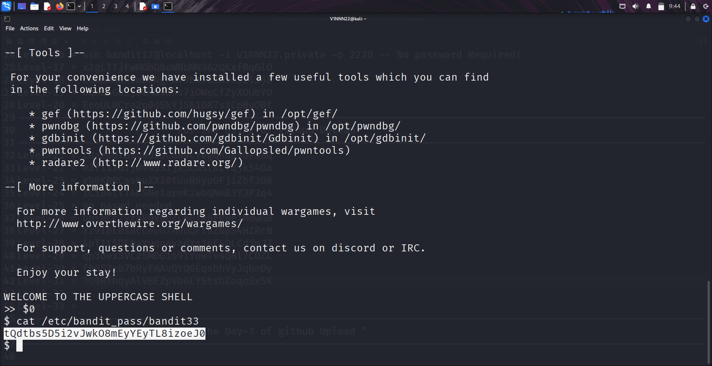

```markdown
# Written by: VINOD .N. RATHOD  

# Bandit Walkthrough — Level 32 → Level 33  

# Date: 26-08-2025  

## Objective  
Retrieve the password for "bandit33". In this level, we are dropped directly into a "special shell environment" when we log in as bandit32. We must figure out how to escape this restricted shell to access the final password.  
```

## **Steps to Solve**

### Step 1 — Login as bandit32

Use the password obtained from the previous level (**Level 31 → 32**):

```bash
   ssh bandit32@bandit.labs.overthewire.org -p 2220
```

---

### Step 2 — Observe the Environment

After logging in, you will notice something unusual:

* You are **not** given a normal bash shell.
* Instead, the shell immediately prints:

```
Welcome to the shell!
```

and waits for input.

This is not bash; it’s a custom shell (called **showtext**) that restricts commands.

---

### Step 3 — Escape the Restricted Shell

Since it’s not a normal shell, typing commands won’t work.
The trick here is to force the shell to run a normal program and then escape into a proper environment.

Type the following:

```bash
   $0
```

* `$0` is a special variable in Linux that refers to the **current shell**.
* Running it in this environment spawns a proper **bash shell**.

Now you are inside a **normal shell** with full command execution power as **bandit32**.

---

### Step 4 — Access the Password for bandit33

Once you have an unrestricted shell, simply read the password file for the next level:

```bash
   cat /etc/bandit_pass/bandit33
```

This will display the password for **bandit33**.

---



### Step 5 — Login as bandit33

With the retrieved password, connect to the final level:

```bash
   ssh bandit33@bandit.labs.overthewire.org -p 2220
```

## **Outcome**

* Learned how to recognize and **escape from a restricted shell**.
* Successfully retrieved the password for **bandit33**, the final level.
* Completed the **Bandit wargame series 🎉**.

---

# THANK YOU!
# \~ **V1NNN22** \~


