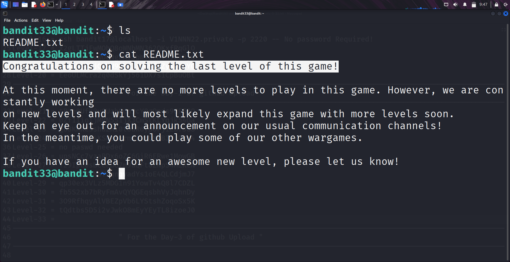

```markdown
# Written by: VINOD .N. RATHOD  

# Bandit Walkthrough — Level 33 (Final Level)  

# Date: 26-08-2025  

## Objective  
Explore the "final level" of the Bandit wargame series. Retrieve the last flag and read the concluding message from the "OverTheWire" team.  
```

## **Steps to Solve**

### Step 1 — Login as bandit33

Use the password obtained from the previous level (**Level 32 → 33**):

```bash
   ssh bandit33@bandit.labs.overthewire.org -p 2220
```

---

### Step 2 — Explore the Home Directory

After logging in, check the contents of the home directory:

```bash
   ls
```

You will see a file named:

```
README.txt
```

---

### Step 3 — Read the Final Message

Open the file to view its contents:

```bash
   cat README.txt
```

Inside, you will find:

* The **final flag** for **bandit33**.
* A short message from the **OverTheWire team**, mentioning that this is the last available level for now, and more levels are being developed.

---




## **Outcome**

* Successfully completed **all available levels** of the Bandit wargame.
* Retrieved the **final flag** from `README.txt`.
* Concluded the series and understood that **new levels will be published in the future**.

---

# THANK YOU!

# \~ **V1NNN22** \~
