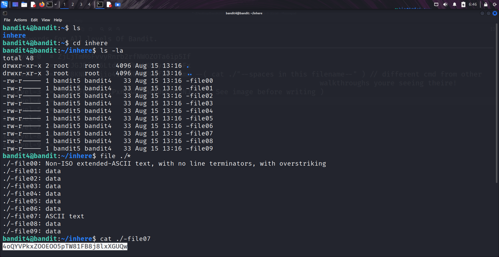

```markdown
# Written by: VINOD .N. RATHOD  

# Bandit Walkthrough — Level 4 → Level 5  

# Date: 19-08-2025  

## Objective  
Retrieve the password for bandit5, which is stored inside one of the files in the `inhere` directory. The correct file is the one containing human-readable text.  
```

## **Steps to Solve**

1. After logging in as **bandit4**, list the files in the current directory:

```bash
   ls -la
```

2. Navigate into the `inhere` directory:

```bash
   cd inhere/
```

3. List all the files inside:

```bash
   ls
```

You will see multiple files with names like `-file00`, `-file01`, etc.

4. To identify which file contains human-readable text, use the `file` command:

```bash
   file ./*
```

5. From the output, notice that **-file07** is of type ASCII text (human-readable).
6. Read its contents to reveal the password:

```bash
   cat ./-file07
```



7. Use the retrieved password to log in as **bandit5**:

```bash
   ssh bandit5@localhost -p 2220
```

## **Outcome**

* Successfully located the file containing human-readable text (`-file07`).
* Retrieved the password for **bandit5**.
* Logged into the server as **bandit5**.

---
# THANK YOU!
# \~ **V1NNN22** \~
