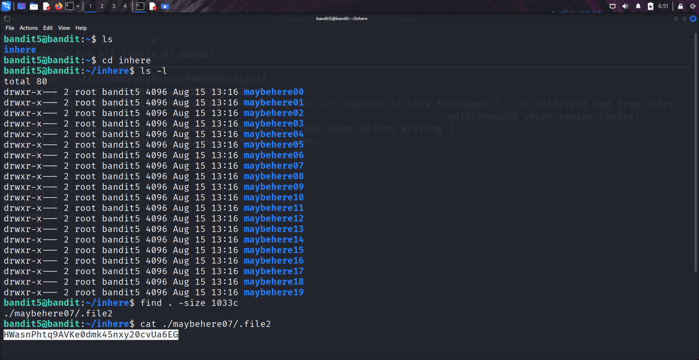

```markdown
# Written by: VINOD .N. RATHOD  

# Bandit Walkthrough — Level 5 → Level 6  

# Date: 20-08-2025  

## Objective  
Retrieve the password for bandit6, which is stored in a file of specific size (1033 bytes) within the `inhere` directory.  
```

## **Steps to Solve**

1. After logging in as **bandit5**, list the files in the current directory:

```bash
   ls
```

2. Navigate into the `inhere` directory:

```bash
   cd inhere/
```

3. List the contents:

```bash
   ls
```

You will see multiple subdirectories containing files.

4. Use the `find` command to locate the file that is exactly **1033 bytes** in size:

```bash
   find . -size 1033c
```

5. From the result, identify the file (e.g., `./maybehere07/.file2`).
6. Read its contents to get the password:

```bash
   cat ./maybehere07/.file2
```



7. Use the retrieved password to log in as **bandit6**:

```bash
   ssh bandit6@localhost -p 2220
```

## **Outcome**

* Successfully located the file of size **1033 bytes**.
* Retrieved the password for **bandit6**.
* Logged into the server as **bandit6**.

---

# THANK YOU!

# \~ **V1NNN22** \~


