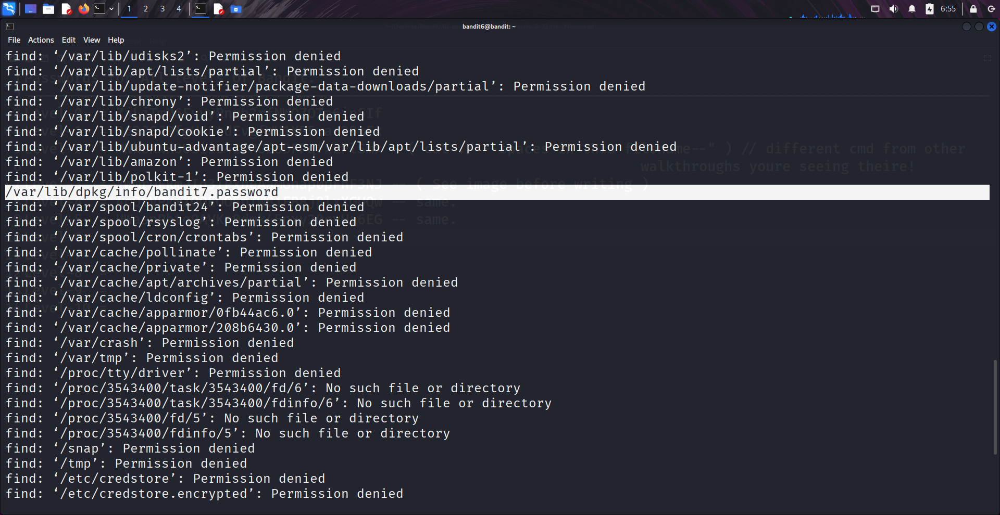
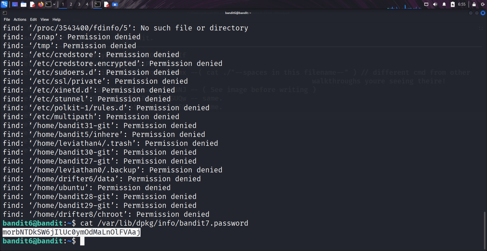

```markdown
# Written by: VINOD .N. RATHOD  

# Bandit Walkthrough — Level 6 → Level 7  

# Date: 20-08-2025  

## Objective  
Retrieve the password for bandit7, which is stored somewhere on the server. The file is owned by user "bandit7", belongs to group "bandit6", and has a size of "33 bytes".  
```

## **Steps to Solve**

1. Since the file could be anywhere on the server, use the `find` command with the given parameters:

```bash
   find / -user bandit7 -group bandit6 -size 33c
```

*Note: Searching from `/` may generate many "Permission denied" errors, which can be ignored.*

2. From the results, you will find the file:

```bash
   /var/lib/dpkg/info/bandit7.password
```



3. Read the contents of this file to get the password:

```bash
   cat /var/lib/dpkg/info/bandit7.password
```



4. Use the retrieved password to log in as **bandit7**:

```bash
   ssh bandit7@localhost -p 2220
```

## **Outcome**

* Successfully located the password file `/var/lib/dpkg/info/bandit7.password`.
* Retrieved the password for **bandit7**.
* Logged into the server as **bandit7**.

---

# THANK YOU!

# \~ **V1NNN22** \~


