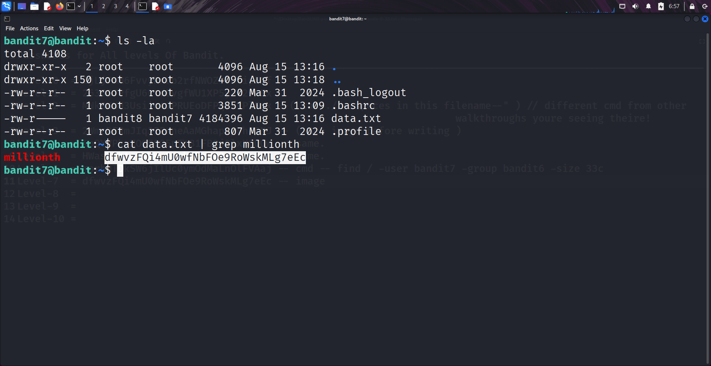

```markdown
# Written by: VINOD .N. RATHOD  

# Bandit Walkthrough — Level 7 → Level 8  

# Date: 20-08-2025  

## Objective  
Retrieve the password for bandit8, which is stored inside the file `data.txt`. The password is located next to the word “millionth”.  
```

## **Steps to Solve**

1. After logging in as **bandit7**, list the files in the current directory:

```bash
   ls
```

You will see a file named `data.txt`.

2. To search for the keyword **“millionth”** inside the file, use the `grep` command. Since the file is large, use a pipe (`|`) to connect `cat` with `grep`:

```bash
   cat data.txt | grep millionth
```

* `cat data.txt` → Reads the file.
* `|` (pipe) → Sends the output of cat to grep.
* `grep millionth` → Filters and shows the line containing the word **millionth**, along with the password.

3. The output will display the word **millionth** followed by the password for **bandit8**.



4. Use the password to log in as **bandit8**:

```bash
   ssh bandit8@localhost -p 2220
```

## **Outcome**

* Successfully located the password inside `data.txt` next to the word **millionth**.
* Logged into the server as **bandit8**.

---

# THANK YOU!

# \~ **V1NNN22** \~

