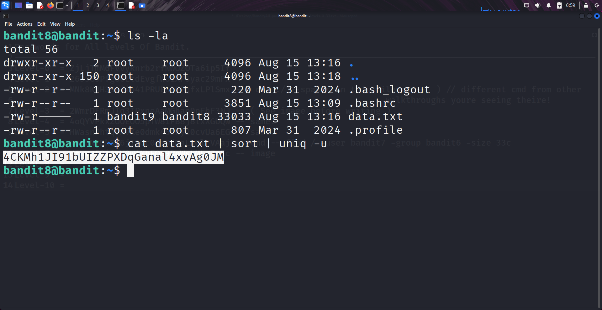

```markdown
# Written by: VINOD .N. RATHOD  

# Bandit Walkthrough — Level 8 → Level 9  

# Date: 20-08-2025  

## Objective  
Retrieve the password for bandit9, which is stored in the file `data.txt`. The hint specifies that the password is the only line of text that occurs exactly once.  
```

## **Steps to Solve**

1. After logging in as **bandit8**, locate the file `data.txt`.
2. Use the following command chain to filter the unique line:

```bash
   cat data.txt | sort | uniq -u
```

* `cat data.txt` → Reads the file.
* `|` (pipe) → Sends output to the next command.
* `sort` → Sorts the lines so duplicates are grouped together.
* `uniq -u` → Prints only the lines that occur once (unique lines).

3. The output will display a single line — this is the password for **bandit9**.



4. Use the retrieved password to log in as **bandit9**:

```bash
   ssh bandit9@localhost -p 2220
```

## **Outcome**

* Successfully identified the unique line in `data.txt`.
* Retrieved the password for **bandit9**.
* Logged into the server as **bandit9**.

---

# THANK YOU!

# \~ **V1NNN22** \~

