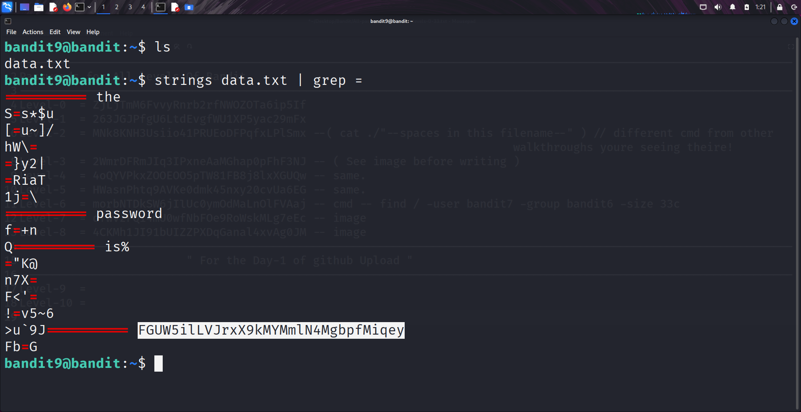

```markdown
# Written by: VINOD .N. RATHOD  

# Bandit Walkthrough — Level 9 → Level 10  

# Date: 21-08-2025  

## Objective  
Retrieve the password for bandit10, which is stored in the file `data.txt`. The hint specifies that the password is the string followed by several `=` characters.  
```

## **Steps to Solve**

1. After logging in as **bandit9**, list the files in the current directory:

```bash
   ls
```

You will see a file named `data.txt`.

2. If you use `cat data.txt`, the output will be filled with unreadable binary data.
   Instead, use the `strings` command, which extracts only human-readable character sequences (default: at least 4 characters long).

3. Pipe the output into `grep` to filter lines containing `=`:

```bash
   strings data.txt | grep =
```

4. The output will display the password for **bandit10**.



5. Use the retrieved password to log in as **bandit10**:

```bash
   ssh bandit10@localhost -p 2220
```

## **Outcome**

* Successfully extracted human-readable strings from `data.txt`.
* Retrieved the password for **bandit10**.
* Logged into the server as **bandit10**.

---

# THANK YOU!

# \~ **V1NNN22** \~
